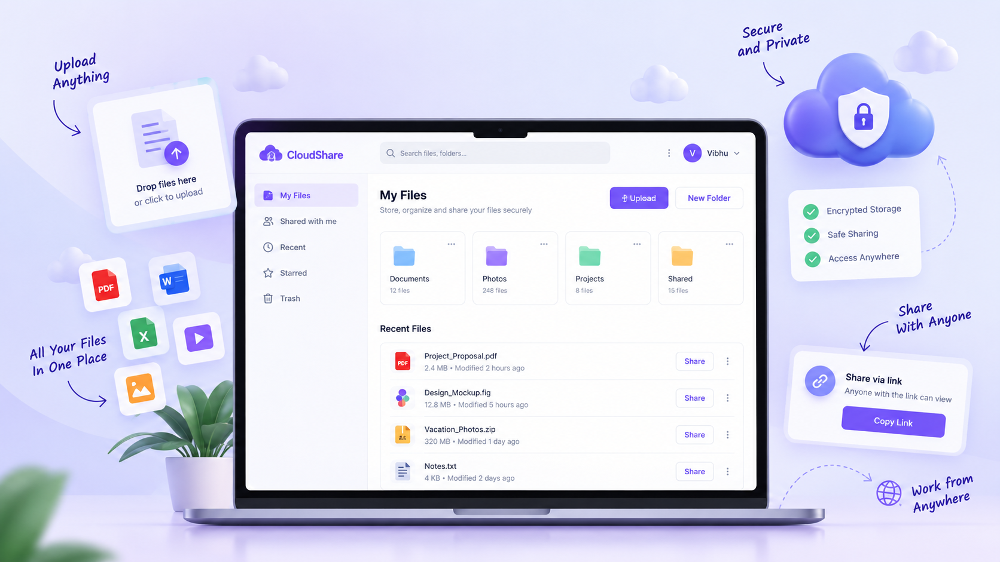

# CloudShare

CloudShare is a secure, full-stack file-sharing platform for uploading, managing, and sharing files from one clean dashboard. It pairs a React interface with a Spring Boot API, MongoDB persistence, Clerk authentication, and Razorpay-powered credit plans.

> This repository currently contains the React + Vite frontend. The Spring Boot and MongoDB services described below are the companion backend architecture and should be configured separately before enabling live file and payment operations.



## Highlights

- Upload and manage files from a dedicated dashboard
- Preview, download, and permanently delete files
- Switch files between private and public access
- Share public files through a link
- Choose between grid and list views for file browsing
- Protect account features with Clerk authentication
- Purchase usage credits through Razorpay
- Review subscription and transaction history
- Responsive interface built with Tailwind CSS and Lucide icons

## Tech stack

| Layer | Technology |
| --- | --- |
| Frontend | React 19, TypeScript, Vite, React Router |
| Styling | Tailwind CSS |
| Icons | Lucide React |
| Authentication | Clerk |
| Backend | Spring Boot |
| Database | MongoDB |
| Payments | Razorpay |
| HTTP client | Axios |

## Application routes

| Route | Access | Purpose |
| --- | --- | --- |
| `/` | Public | Landing page, features, pricing, and testimonials |
| `/dashboard` | Signed in | Account overview |
| `/upload` | Signed in | Upload new files |
| `/my-files` | Signed in | Browse and manage uploaded files |
| `/subscription` | Signed in | View or upgrade the plan |
| `/transactions` | Signed in | Review payment and credit activity |

Unauthenticated visitors are redirected to Clerk’s sign-in flow when they open a protected route.

## Getting started

### Prerequisites

- Node.js 20 or later
- pnpm (recommended) or npm
- A [Clerk](https://clerk.com/) application and publishable key
- A running Spring Boot API when connecting live data

### 1. Install dependencies

```bash
pnpm install
```

### 2. Configure environment variables

Copy the provided template:

```bash
Copy-Item .env.example .env
```

Then set the following values in `.env`:

```env
# Clerk Authentication
VITE_CLERK_PUBLISHABLE_KEY=pk_test_your_clerk_publishable_key

# Spring Boot API base URL
VITE_API_URL=http://localhost:5000
```

`VITE_CLERK_PUBLISHABLE_KEY` is required at startup. Do not commit `.env` or put private credentials in any `VITE_` variable, as Vite exposes them to the browser.

### 3. Run the frontend

```bash
pnpm dev
```

Open the local URL printed by Vite (typically `http://localhost:5173`).

## Available scripts

| Command | Description |
| --- | --- |
| `pnpm dev` | Start the Vite development server |
| `pnpm build` | Type-check and create a production build |
| `pnpm lint` | Run ESLint |
| `pnpm preview` | Serve the production build locally |

## Backend integration

The client expects a Spring Boot service at `VITE_API_URL`. A production backend should:

1. Verify the Clerk session/token for protected API requests.
2. Store file metadata, ownership, access state, and transaction records in MongoDB.
3. Store uploaded file bytes in the selected storage provider and expose authorized download/preview endpoints.
4. Provide an unauthenticated public-file endpoint only for files explicitly marked public.
5. Create and verify Razorpay payment orders on the server; never expose Razorpay secrets in the client.

Typical file metadata includes an owner ID, original filename, MIME type, size, storage key, visibility (`private` or `public`), and timestamps. Public links should use unguessable identifiers and should be revocable when access is switched back to private or the file is deleted.

## Suggested API surface

| Method | Endpoint | Description |
| --- | --- | --- |
| `POST` | `/api/files` | Upload a file for the signed-in user |
| `GET` | `/api/files` | List the current user’s files |
| `GET` | `/api/files/{id}/download` | Download an owned file |
| `PATCH` | `/api/files/{id}/visibility` | Change a file’s public/private state |
| `DELETE` | `/api/files/{id}` | Delete an owned file |
| `GET` | `/api/public/files/{shareId}` | View or download a publicly shared file |
| `POST` | `/api/payments/orders` | Create a Razorpay order |
| `POST` | `/api/payments/verify` | Verify the Razorpay payment signature |

Adapt endpoint names to match the companion backend; this table is a contract recommendation rather than a claim that these routes are already implemented in this frontend repository.

## Project structure

```text
src/
├── components/       # Shared UI, authentication guard, landing-page sections
├── pages/            # Route-level screens
├── assets/           # Static content and images
├── types/            # TypeScript models
├── App.tsx           # Route definitions
└── main.tsx          # Clerk and React bootstrap
```

## Security notes

- Enforce ownership checks on every authenticated file action.
- Validate file type and size on the server, not only in the browser.
- Keep MongoDB, Clerk secret keys, storage credentials, and Razorpay key secrets server-side.
- Verify Razorpay signatures server-side before granting credits or plan access.
- Use signed URLs or an authenticated download stream for private files.

## Contributing

Contributions are welcome. Please create a focused branch, run `pnpm lint` and `pnpm build`, and describe the user-facing impact in your pull request.

## License

Add a license file (for example, MIT) before distributing this project publicly.
